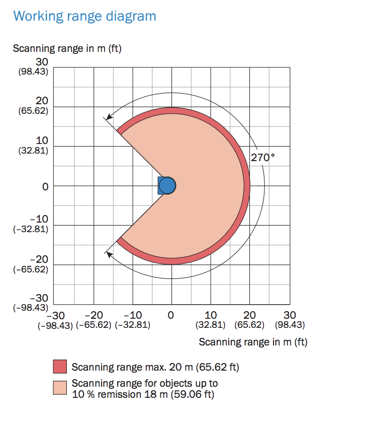

# SICK LMS111-10100 Provisioning

The SOPAS engineering tool from SICK provides configuration and monitoring.
This is a windows-only tool.

## Coordinate System

All coordinates expressed from the driver's forward-looking view. 

0 degrees is left, 90 degrees is straight forward, 180 degrees is right. The lidar can scan fro -45 to 225 degrees.

